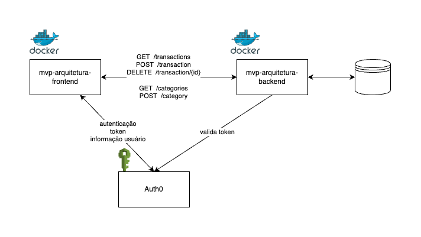

# YourExpenses Backend

YourExpenses Backend é a parte do servidor do aplicativo YourExpenses, responsável por fornecer as APIs necessárias para gerenciar transações e categorias, bem como para calcular e fornecer dados para as tabelas e dashboard.

# Diagrama de Arquitetura


## Funcionalidades

1. **Documentação da API**:
   - A documentação completa das APIs pode ser acessada via Swagger em: [http://localhost:5000/apidocs/#/](http://localhost:5000/apidocs/#/)

## Requisitos

- Python 3.x
- Docker

## Instruções de Execução

1. Clone este repositório:

   ```bash
   git clone https://github.com/gutakeda/mvp-arquitetura-backend.git
   cd mvp-arquitetura-backend
   ```

2. Crie a imagem local

   ```bash
   docker build -t mvp-arquitetura-backend .
   ```

3. Crie o arquivo .env na raiz do projeto e adicione as seguintes variáveis de ambiente:
   ```bash
   API_AUDIENCE=...
   AUTH0_DOMAIN=...
   ALGORITHMS=RS256
   ```

4. Rode a imagem

   ```bash
   docker run --env-file .env -p 5000:5000 mvp-arquitetura-backend
   ```

## Swagger

1. Para ter acesso aos detalhes das APIs, basta seguir os passos anteriores para rodar a aplicação e em seguida acessar o swagger pela rota:
   ```
   http://localhost:5000/apidocs/
   ```


## Licença

Este projeto está licenciado sob a Licença MIT - veja o arquivo [LICENSE.md](LICENSE.md) para mais detalhes.

---

Esperamos que você aproveite o uso do YourExpenses para organizar suas finanças de maneira mais eficiente!
